# The reports

The reports broadly break down into 3 categories

* Reports to interrogate your data e.g. books which are on multiple shelves
* Reports on books you have read e.g. favourite authors/shelves/decades
* Reports on books you haven't read e.g. least read shelves/decades,
  visualization of to-be-read pile (aka TBR aka Mount Tsundoku)

## Command-line arguments

The reports take command-line arguments, many of which are shared between them.
Do `name_of_report.py -h' to see the help page documenting what any given
report script supports.

All reports take an argument to indicate where the CSV file from GoodReads is
located.  Because this is common, and annoying to retype, you can instead set
the `GR_CSV_FILE` environment variable to the file's location, which will remove
the need to specify it on each invocation.

### Properties

All books have a number of properties (aka attributes) such as author, title
and rating.  As described below, these can be used for filtering, sorting or
modifying output in scripts which support that functionality.

To get a list of property names, run

    ./shelf_intersection -P

Not all properties are useful and/or usable in all circumstances.  Ones of
particuler note are:

* book_id - An internal Goodreads numeric identifier.
* clean_title - Book title sans any parenthesized series and/or volume number.
* markdown - the book author and (clean) title with a URL in [Markdown](https://en.wikipedia.org/wiki/Markdown), useful when posting into Reddit or similar
* padded_rating_as_stars - as "rating_as_stars", but always 5 characters long, so useful for nicer formatting
* publisher - the publisher, sans any generic prefix/suffix such as "Ltd", "Press" - use raw_publisher if you need the original value from Goodreads
* rating_as_stars - "rating" is a number from 1 to 5, this is the equivalent from * to *****
* series, series_and_volume, volume - the information extracted from any parenthesised details.

### Filters

Scripts accepting `-f` filters can optionally filter only books that match
certain critera.  Multiple filters can be specified to indicate that only books
matching all the filter criteria should be displayed.  (This is a logical AND,
or intersection of the sets, if you prefer.)

There are two types of filters.

#### Shelf filters

These are just a single textual element, indicating that only books on a
particular named shelf should be included.  Alternatively, prefix the shelf name
with an exclamation-mark ! or tilde ~ to filter on books *not* on that shelf.

(Tip: The tilde variant may be preferable, as some Unix/Linux shells may try to
interpret strings prefixed with an exclamation mark as something else, causing
the filter to fail.)

#### Comparison filters

These are of the form `property comparator value`, and indicate that only books
where a property is equal/not equal/greater than/etc a particular value should
be included.

The supported properties are not yet documented outside of the code in
`utils/book.py`.

Supported comparators are:

* `=` or `==` - equals
* `!=` or `<>` - not equal to
* `~` or `~=` or `=~` - textual match (specifically, [regular expression](https://en.wikipedia.org/wiki/Regular_expression) match)
* `>` - greater than
* `>=` or `=>` greater or equal than
* `<` - less than
* `<=` or `=<` less or equal than

Values should be whatever makes sense in the context of any particular property.
Dates are supported in `yyyy-mm-dd` or `yyyy/mm/dd` formats.

#### Filter examples

* `-f non-fiction` - Show only books on the non-fiction shelf
* `-f ~non-fiction` - Exclude books on the non-fiction shelf
* `-f non-fiction -f british-author` - Show only books which are on both the non-fiction and british-author shelves
* `-f year > 2000` - Show only books published in the 21st century
* `-f author ~ john` - Show only books written by people with John in their name (note that search is case insensitive, and against the entire name, so authors with the surname Johnson would be included, for example

Note that certain scripts use some built-in filtering that cannot be
overridden, in order to produce sensible results.  e.g. Anything reporting
on your particular ratings will filter out books which you have not read.

### Limiting results

Scripts accepting a `-l <number>` argument will output no more than the
specified number of results.

### Enumerating/ranking results

Scripts accepting a '-e' argument will print 1, 2, 3, 4, etc at the start of
each line, or 1, 2, 2, 4, 4, 4, 7 etc where ranking numbers are more applicable.

### Colour configuration

Scripts accepting a `-c <colour-config-file>` argument will take a JSON
configuration file indicating how books on particular shelves or with particular
properties will be displayed.  (This JSON configuration format is not yet
documented, but an example file should give sufficient hints to the curious.)

### Including all listed authors

By default, any reports based around authors will only use the single author
listed in the Author column of the CSV.  Scripts accepting the `-a` flag can
instead use that author plus those listed in the Additional Authors column.

It should be noted that the Additional Authors data has the following issues
though, which is why using that data is not the default behaviour:

* Additional authors are often people who just wrote a short introduction to
  the main text, which probably isn't of interest for most reports.
* Anthologies often have missing or incomplete contributor lists.

### Output width

Some graphical reports accept a `-w number-of-characters` argument to specify
how wide (in terms of characters) the output should be.  For such reports, if
the argument is omitted, then the report will output based on the width of the
terminal.

### Effective date

Some reports can provide a historical viewpoint on your collection e.g. which
books did you own at a particular point in time.  This can be specified via
the `-d yyyy-mm-dd` date argument.

Note that this applies only to explicitly date-oriented information i.e. the
dates a book was added or read.  For anything else, only the current data is
used e.g. there is no way of knowing when a book was added to a particular shelf.

### Sorting output

Reports which output a list of books may support one or more '-s property_name'
arguments to sort the output accordingly.

## Data interrogation reports

### analyse_book_percentages.py

Outputs a list of shelves, showing how many books are on that shelf, and what
percentage of your collection that shelf works out as.  Because books can be
on multiple shelves, it is almost certain that these figures will total to be
more than the number of books your collection or 100% respectively.

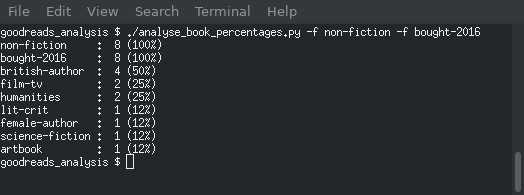

Arguments accepted:

* `-f filters`

### avg_page_count.py

Outputs the mean number of pages of particular groupings of books, additionally
indicating how many books are in that grouping.

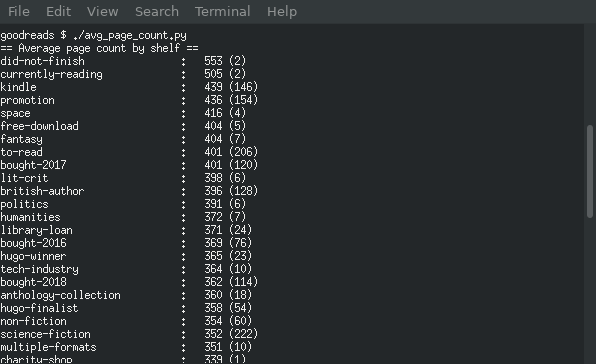

Arguments accepted:

* `-f filters`

**Note**: this script currently reports for multiple groupings - shelves, decades,
rating, etc.  It is likely this single script will be split up into smaller
ones each reporting on a single grouping.

### publication_year.py

Outputs a list of books ordered by year.

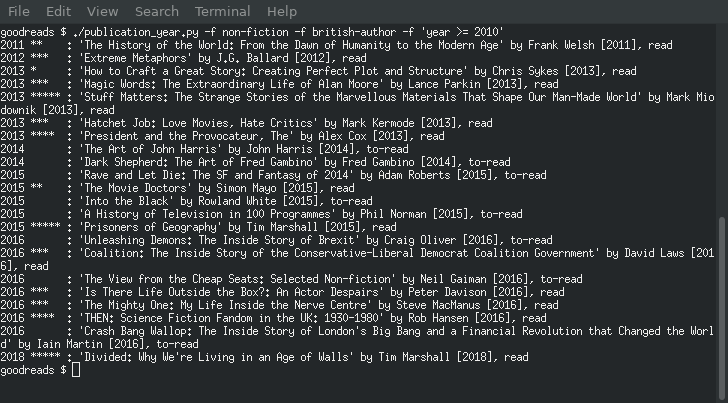

Arguments accepted:

* `-f filters`
* `-s` - Output a blank line between years (this makes the output slightly more readable)

Enhancements made to shelf_intersection.py since this script was first written
mean that you canreplicate this script's output as follows

    /shelf_intersection.py -m "{year} {padded_rating_as_stars} : '{title}' by {author} [{year}], {status}" -s year

### shelf_intersection.py

Output a list of books (in arbitrary order) matching the supplied filters.

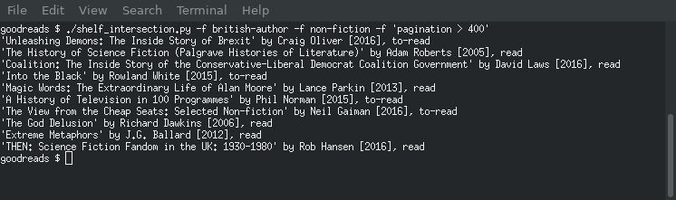

Arguments accepted:

* `-e` - Enumerate books (i.e. prepend 1, 2, 3, etc to each line)
* `-f filters`
* `-i separator` - Rather than the default of one book per line, output the books inline, separated by given characters
* `-I separator` - As -i, but line break whenever a sort value changes
* `-m format` - Use a custom output format, with property names in curly parentheses {}
* `-p properties` - Also output the values of the specified properties.
* `-P` - Output a list of supported property names
* `-s sort_properties`

### year_on_year_by_*.py

Output a table of years (added or read) versus shelves, decade, rating, etc.

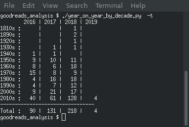

Arguments accepted:

* `-f filters`
* -p - Display percentages instead of number of books
* -r - Display by year read (default is to use year added)
* -t - Display an additional line showing the totals per year

## Reports on books read

All of these reports automatically apply a filter to only include books which
have been read.

### best_ranked_*.py

For given groupsings of books, show what the average rating for the books in that
group is, along with the number of books in that group, and a graphical
representation of the rankings.

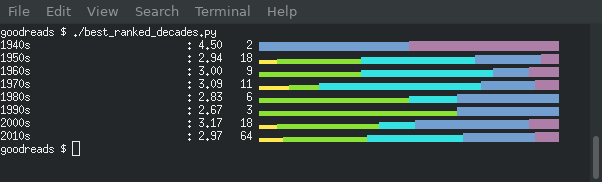

In the above example, 2 books from 1940s have been rated, one a 4-stars (blue)
and one at 5-starts (purple).

**Note**: Some of these scripts report by order of ranking, others by the
property value.  This may be configurable by a command-line argument in
future.

Arguments accepted:

* `-f filters`
* `-a` - best_ranked_authors.py only

### most_read_authors.py

Show the authors who you have read the most, along with their average rating
and breakdown.  Implements the functionality removed from the Goodreads
website in January 2019.  (In terms of implementation, this is the same as
`best_ranked_authors.py`, just sorted by number of books read rather than
average rating.

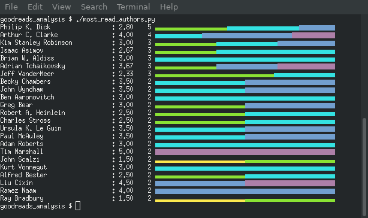

Arguments accepted:

* `-a` - Show all authors/contributors to a book, not just the primary one
* `-e` - Rank authors (i.e. prepend 1, 2, 2, 4, etc on each line)
* `-f filters`

### most_recently_read_shelves.py

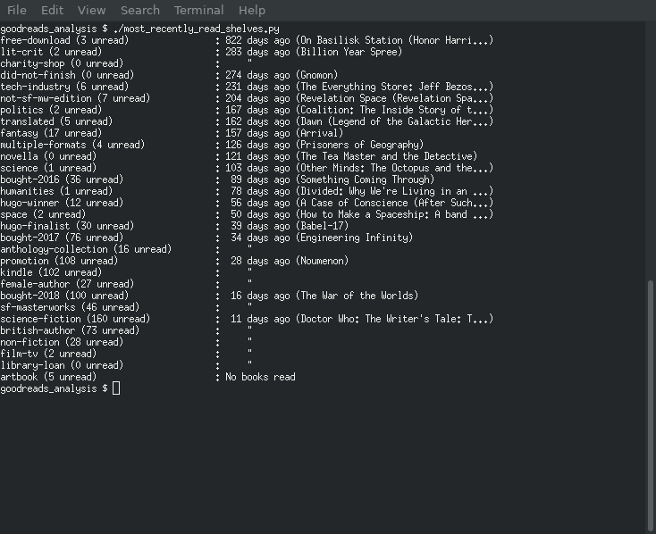

Although this report is (primarily) about books you have read, the intention is
that it may help you choose your next book to read e.g. if you haven't read
a book in a particular genre recently, then perhaps one from that genre might
be a good choice for your next read.

## timeline_by_*.py

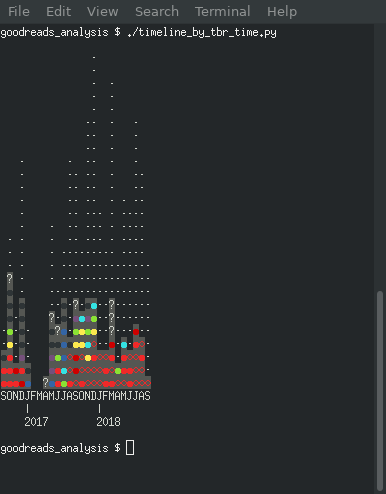

Draws a time chart showing the books acquired in a particular month, and
which ones have been read.  There are variant scripts that style the read books
according to how long they went unread, how they were rated, etc.

Arguments accepted

* `-f filters`
* `-c colour-configuration-file`
* `-d date`

### read_scatter_plot_by_rating.py

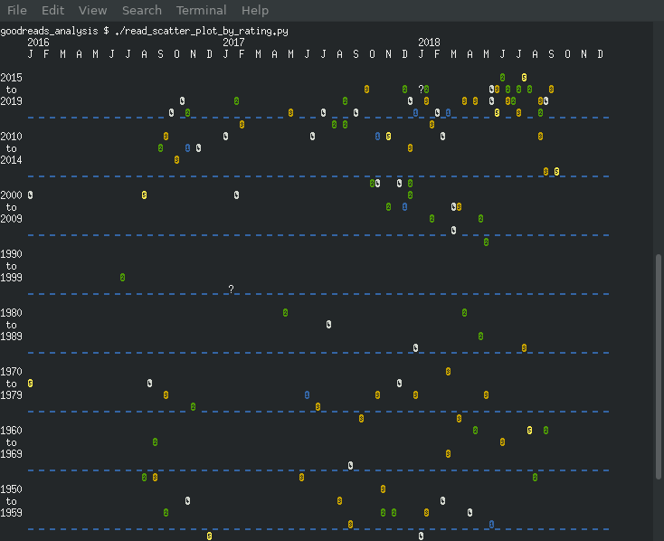

This is conceptually the same as the one available on the GoodReads site in
MyBooks > Stats > Publication Year, but with the following differences:

* The vertical scale for publication year varies according to the number of
  books read from that period.  This is based on the idea that you will be
  more widely read in some periods than others - for example, many people
  probably have read a lot more 21st century books than from the 19th century
  or earlier.
* The points for each book are styled according to the rating you gave it.

(Obviously the textual nature of this report means that it lacks some of
the functionality of a web based report, such as the behaviour when hovering
or clicking on a book.)

Arguments accepted:

* `-f filters`
* `-w width`

## Reports on books to be read

### draw_tsundoku_by_*.py

Draw a graphical representation of all the books you are yet to read, and those
you have, colour coded by the type of book.

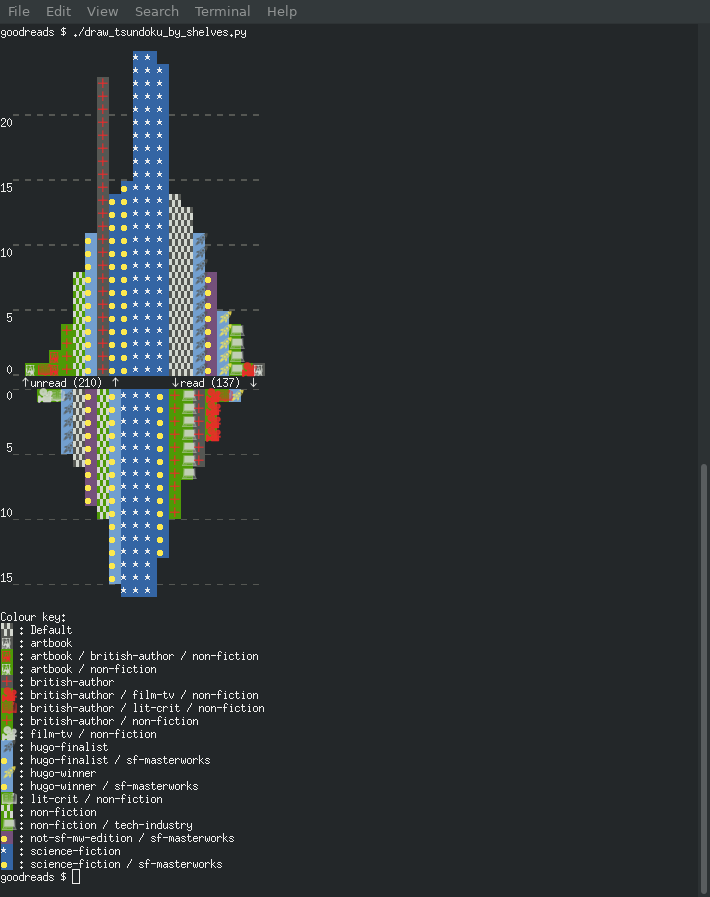

The upper "mountain" represents the books to be read, and the lower one
represents the books you have read, with the total books in each category
displayed at "ground level".

Arguments accepted:

* `-f filters`
* `-c colour-configuration-file`
* `-d date`

The colour configuration is not yet documented, and requires a fair bit of
trial-and-error to get ideal results.  I have ideas for how a colour code might
be automagically generated that might produce OK renderings, but this is not
yet implemented.

### least_read_*.py

On the assumption that you might want to have read a diverse set of books, this
report shows which shelves/decades/etc in your collection are least read.

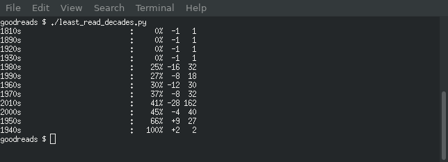

The percentage value is the number of books you have read, the second number
is the difference between the number read and the number to-read, and the final
number is the total number of books in this group.

Arguments accepted:

* `-a filters` - least_read_authors.py only

### longest_on_tbr_pile.py

This report points out how shamefully long some books in your collection have
gone unread.

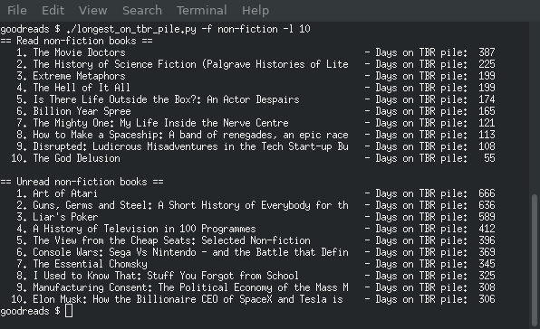

Arguments accepted:

* `-f filters`
* `-l limit`
* `-p period` - do not show books that have been unread for less than a particular number of days (default 31)

**Note**: This report currently outputs both

* which books have been waiting to be read the longest
* which books have been read, but had to wait the longest before they eventually got read

As the latter is of less interest, this script is likely to be split up into
two separate reports, each only reporting on one of these groupings.

